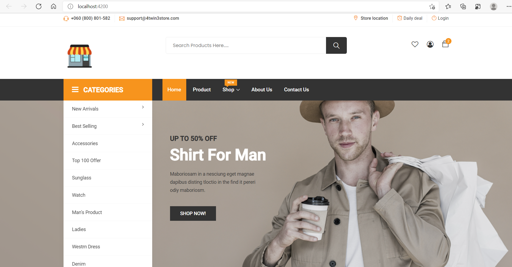

# AngularStore 

<div id="top"> </div>


  
[![Contributors][contributors-shield]][contributors-url]
[![Forks][forks-shield]][forks-url]
[![Issues][issues-shield]][issues-url]
[![MIT License][license-shield]][license-url]
[![LinkedIn][linkedin-shield]][linkedin-url]
  

<!-- PROJECT LOGO -->
<br />
<div align="center">


  


<h3 align="center">Angular Store-Template</h3>

  <p align="center">
This is the official Angular Store documentation <br/>
  </p>
</div>


<!-- TABLE OF CONTENTS -->
<details>
  <summary>Table of Contents</summary>
  <ol>
    <li>
      <a href="#about-the-project">About The Project</a>
      <ul>
        <li><a href="#built-with">Built With</a></li>
      </ul>
    </li>
    <li>
      <a href="#getting-started">Getting Started</a>
      <ul>
        <li><a href="#prerequisites">Prerequisites</a></li>
        <li><a href="#installation">Installation</a></li>
      </ul>
    </li>
    <li><a href="#usage">Usage</a></li>
    <li><a href="#roadmap">Roadmap</a></li>
    <li><a href="#contributing">Contributing</a></li>
    <li><a href="#license">License</a></li>
    <li><a href="#contact">Contact</a></li>
    <li><a href="#acknowledgments">Acknowledgments</a></li>
    
  </ol>
</details>


<!-- ABOUT THE PROJECT -->
## About The Project

[](https://example.com)

### ---------------------------------------------ADMIN PAGE------------------------------------------------------------


We have built an e-commerce website that features different products with different categories, prodviders ... and we have an admin that he manage website Infrastructure with his own template.

the Admin Code Source : <a href="https://github.com/MouhebMhamdi/dashboardAdmin">Click Here</a><br><br>


These are the main features of our website :
* Clients Management
* Products Management 
* Payment Management 
* Providers Management 
* Stock Management
* Claims Management 

 Thanks to all the people that have contributed to expand this project!


<p align="right">(<a href="#top">back to top</a>)</p>


### Built With

This is the list of the major frameworks/libraries used to build our project. 
<br/>
* [Angular](https://angular.io/)
* [Angular Material](https://material.angular.io/)
* [Bootstrap](https://getbootstrap.com)
* [Fontawesome](https://fontawesome.com/)
* [Spring Boot](https://spring.io/projects/spring-boot)
* [Hibernate](https://hibernate.org/)

<p align="right">(<a href="#top">back to top</a>)</p>


<!-- GETTING STARTED -->
## Getting Started

This is an example of how you may give instructions on setting up your project locally.
To get a local copy up and running follow these simple example steps.

### Prerequisites

This is an example of how to list things you need to use the software and how to install them.
* npm
  ```sh
  npm install npm@latest -g
  ```

### Installation

_In order to install the app you need to follow the instructions below :_

1. Clone the repo
   ```sh
   git clone https://github.com/MouhebMhamdi/AngularFront.git
   ```
2. Install NPM packages
   ```sh
   npm install
   ```
3. Run the server
   ```sh
   ng serve --open
   ```

<p align="right">(<a href="#top">back to top</a>)</p>


<!-- USAGE EXAMPLES -->
## Usage

Use this space to show useful examples of how a project can be used. Additional screenshots, code examples and demos work well in this space. You may also link to more resources.

_For more examples, please refer to the [Documentation](https://example.com)_

<p align="right">(<a href="#top">back to top</a>)</p>


<!-- ROADMAP -->
## Roadmap

- [x] Application FrontEnd 
- [x] Make Reactive forms 
- [x] Make Login Logout forms 
- [x] Add "components" product and try to list products from spring boot 
- [ ] Multi-language Support
  - [ ] Chinese
  - [ ] Spanish

See the [open issues](https://github.com/othneildrew/Best-README-Template/issues) for a full list of proposed features (and known issues).

<p align="right">(<a href="#top">back to top</a>)</p>


<!-- CONTRIBUTING -->
## Contributing

If you have a suggestion that would make this better, please fork the repo and create a pull request. You can also simply open an issue with the tag "enhancement".
Don't forget to give the project a star! Thanks again!

1. Fork the Project
2. Create your Feature Branch (`git checkout -b Yourbranch`)
3. Commit your Changes (`git commit -m 'Add some features to project'`)
4. Push to the Branch (`git push origin Yourbranch`)
5. Open a Pull Request

<p align="right">(<a href="#top">back to top</a>)</p>


<!-- LICENSE -->
## License

Distributed under the MIT License. See `LICENSE.txt` for more information.

<p align="right">(<a href="#top">back to top</a>)</p>


<!-- CONTACT -->
## Contact

Email : 4TWIN3@esprit.tn

Project Link: [https://github.com/MouhebMhamdi/AngularFront](https://github.com/your_username/repo_name)

<p align="right">(<a href="#top">back to top</a>)</p>


<!-- ACKNOWLEDGMENTS -->
## Acknowledgments

Use this space to list resources you find helpful and would like to give credit to. I've included a few of my favorites to kick things off!

* [Choose an Open Source License](https://choosealicense.com)
* [GitHub Emoji Cheat Sheet](https://www.webpagefx.com/tools/emoji-cheat-sheet)
* [Img Shields](https://shields.io)
* [GitHub Pages](https://pages.github.com)
* [Font Awesome](https://fontawesome.com)

<p align="right">(<a href="#top">back to top</a>)</p>


<!-- MARKDOWN LINKS & IMAGES -->
<!-- https://www.markdownguide.org/basic-syntax/#reference-style-links -->
[contributors-shield]: https://img.shields.io/github/contributors/othneildrew/Best-README-Template.svg?style=for-the-badge
[contributors-url]: https://github.com/MouhebMhamdi/AngularFront/graphs/contributors
[forks-shield]: https://img.shields.io/github/forks/othneildrew/Best-README-Template.svg?style=for-the-badge
[forks-url]: https://github.com/othneildrew/Best-README-Template/network/members
[stars-shield]: https://img.shields.io/github/stars/othneildrew/Best-README-Template.svg?style=for-the-badge
[stars-url]: https://github.com/othneildrew/Best-README-Template/stargazers
[issues-shield]: https://img.shields.io/github/issues/othneildrew/Best-README-Template.svg?style=for-the-badge
[issues-url]: https://github.com/othneildrew/Best-README-Template/issues
[license-shield]: https://img.shields.io/github/license/othneildrew/Best-README-Template.svg?style=for-the-badge
[license-url]: https://github.com/othneildrew/Best-README-Template/blob/master/LICENSE.txt
[linkedin-shield]: https://img.shields.io/badge/-LinkedIn-black.svg?style=for-the-badge&logo=linkedin&colorB=555
[linkedin-url]: https://linkedin.com/in/othneildrew
[product-screenshot]: images/screenshot.png
© 2021 GitHub, Inc.
Terms
Privacy
Security
